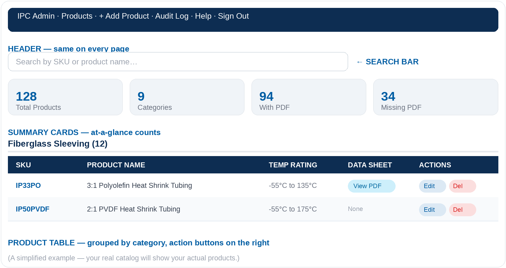

Subject: IPC Website — Admin Dashboard Access & Documentation

Hi Rick,

**What's attached**

I've put together a complete documentation guide, attached here as a Word document (*IPC Admin Dashboard – Help and Documentation.docx*). It walks through everything the admin dashboard can do, including:

- Adding, editing, and removing products from the catalog
- Uploading and managing PDF data sheets
- Building the specifications list and size chart shown on each product page
- Signing in and out, and where your login details are kept
- A troubleshooting section and glossary for anything unfamiliar

This same guide is also available anytime inside the dashboard itself — once you're signed in, just click **Help** in the top navigation bar.

**Your login details**

- Admin Dashboard: [https://insulationproducts.com/admin/]
- Password: ipc-admin-2026

**Getting started**

1. Click the admin dashboard link above (or type it into your browser).
2. Enter the password above and click **Sign In**.
3. You'll land on the **Product Catalog** page — this is your home base, showing every product currently on the site.
4. From any page, click **Help** in the top navigation whenever you want a refresher — it covers every task step by step with examples.

Here's a quick preview of what you'll see once you're signed in:

*(This is an illustrative example, not your live data — but the layout will look exactly like this.)*

**A few tips to start**

- Bookmark the admin address above for quick access.
- Any change you make appears on the live website automatically, usually within about a minute.
- If anything looks off or a page won't save, the **Troubleshooting & FAQ** section in the attached guide covers the most common issues.

I'm happy to hop on a quick call and walk through it together if that would help — otherwise, feel free to reach out anytime with questions.

Best,
Keagan
